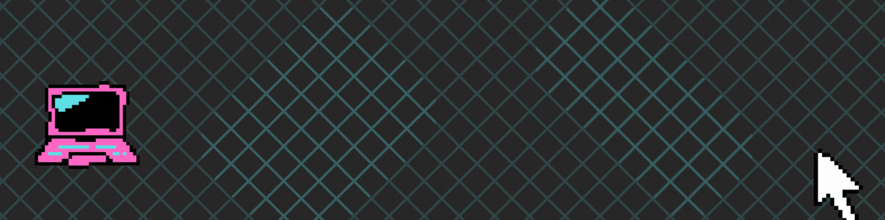

  
 

Em constante evolução, movida pela paixão por tecnologia e pelo desafio do aprendizado contínuo.

Atualmente com foco no desenvolvimento back-end.

Cursando Engenharia de Software na Ampli e Análise e Desenvolvimento de Sistemas na FACINT.

---

  
  

    
    
    
  

  
   
  

---

### 🔧 **Ferramentas Principais**

  
  
  
  
  
  
  
  
  

---
### 📚 🛠️ **Ferramentas em Estudo**

  
  
  
  
  
  
  
  
 

---

